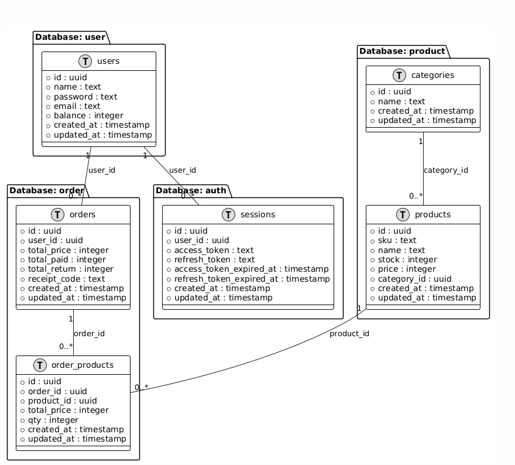

# Go Microservices

POS-API is developed using the **Microservices** architecture pattern.

---

## 📌 What are Microservices?

`Microservices` is an architectural approach where an application is divided into small, self-contained services, each serving a specific business function. These services can be developed in different programming languages, deployed, scaled, and maintained independently, while communicating through well-defined APIs.

In practice, Microservices architecture works as shown in the following diagram:

---

## 📊 Database Diagram

The **Entity Relationship Diagram (ERD)** of this project is as follows:



---

## 📖 Introduction

This project follows the **Microservices** architecture, as explained earlier. It serves as a **boilerplate/template**, providing an example and guide for developers looking to build microservices-based applications using Golang.

💡 **Check out the API documentation:** 

---

## ⚡ Features

- Docker container per service
- Dedicated database per service
- Inter-service communication using gRPC
- Available services:
  - **User Service**
  - **Product Service**
  - **Order Service**
  - **Auth Service**
- Well-documented API with Swagger

---

## 🚀 Installation

### 1️⃣ Clone the repository

```bash
git clone https://github.com/AzzamSyakir/go-micro-services.git
```

### 2️⃣ Build and run the project

```bash
go mod tidy
make start-docker
```

### 3️⃣ Run tests

```bash
make start-test
```

---

# ID

## 📌 Apa Itu Microservices?

`Microservices` adalah pendekatan arsitektur di mana sebuah aplikasi dibagi menjadi layanan-layanan kecil yang berdiri sendiri, masing-masing memiliki fungsi bisnis tertentu. Setiap layanan dapat dikembangkan dengan berbagai bahasa pemrograman, dideploy, diskalakan, dan dikelola secara independen, serta berkomunikasi melalui API yang terdefinisi dengan baik.

Dalam praktiknya, arsitektur Microservices bekerja seperti yang ditunjukkan dalam diagram berikut:

---

## 📊 Diagram Basis Data

Berikut adalah **Entity Relationship Diagram (ERD)** dari proyek ini:


---

## 📖 Pendahuluan

Proyek ini menggunakan arsitektur **Microservices**, seperti yang telah dijelaskan sebelumnya. Proyek ini bertujuan sebagai **boilerplate/template**, memberikan contoh dan panduan bagi developer dalam membangun aplikasi berbasis microservices dengan Golang.

💡 **Lihat dokumentasi API:** 

---

## ⚡ Fitur

- Setiap layanan berjalan dalam **container Docker**
- Setiap layanan memiliki **database sendiri**
- Komunikasi antar layanan menggunakan **gRPC**
- Layanan yang tersedia:
  - **User Service**
  - **Product Service**
  - **Order Service**
  - **Auth Service**
- Dokumentasi API yang lengkap dengan **Swagger**

---

## 🚀 Instalasi dan running projek

### 1️⃣ Clone repository

```bash
git clone https://github.com/AzzamSyakir/go-micro-services.git
```

### 2️⃣ Build dan jalankan proyek

```bash
go mod tidy
make start-docker
```

### 3️⃣ Jalankan unit test

```bash
make start-test
```

---
